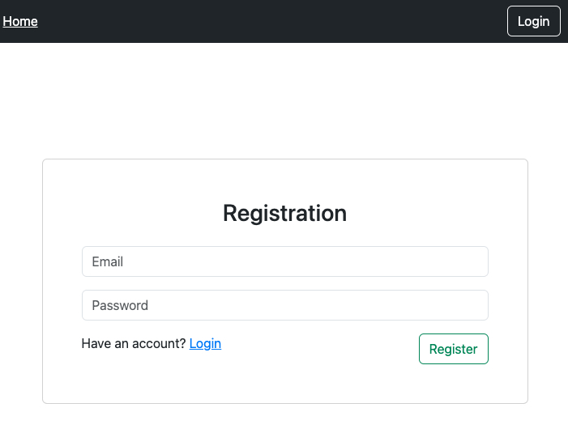
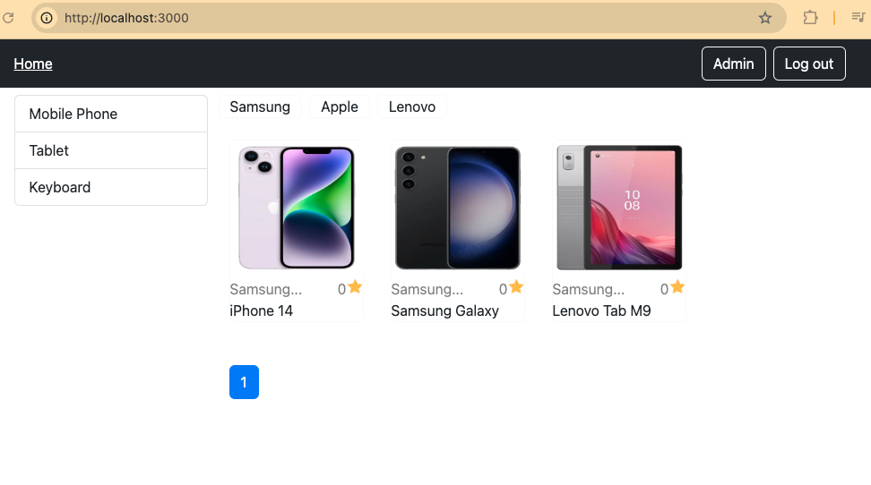
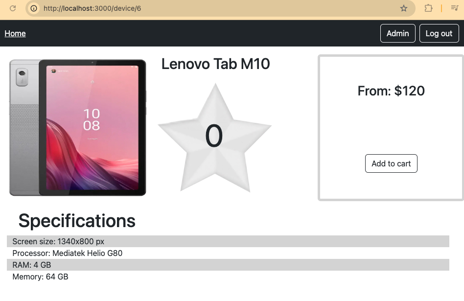
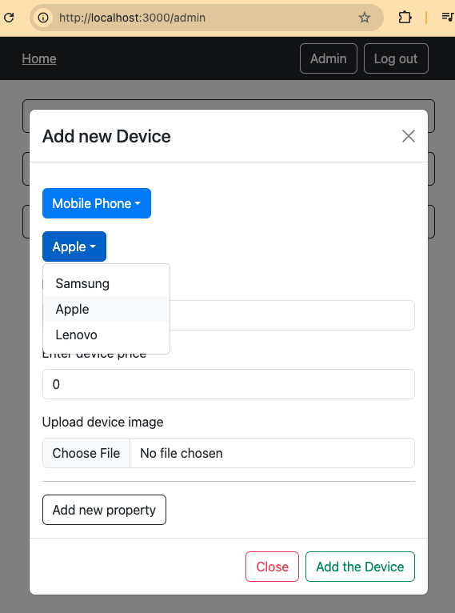
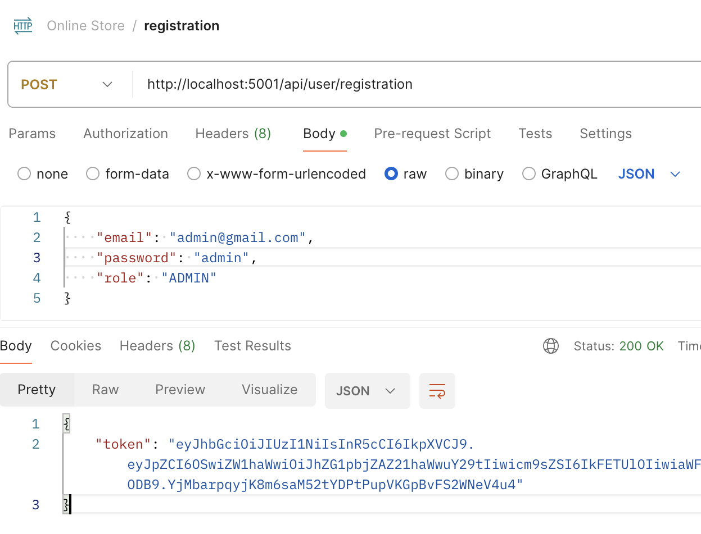

# Online Store Project

An online store built with React, PostgreSQL, Express, and MobX. This project is a work in progress, aiming to deliver a functional e-commerce platform with features for both users and administrators.

## Features

### User Roles
- **USER:** Registered via the user interface, granted a default role of `USER`.
- **ADMIN:** Added manually to the database with elevated permissions.

### User Authentication
- Supports **user registration** and **login**.
- Public and private routes ensure secure access to admin-only features.

  

### Public Features
- **Homepage:** Displays all available products for unauthorized and authorized users.
  
- Products are categorized by Brands and Types.
- Each product includes:
  - **Name**
  - **Price**
  - **Image**
  - **Dynamic properties** _(e.g., size, color, etc.)_
  - **5 Star Rating** - _WIP_

  

### Admin Features
- Access to an admin panel (private route).
- Admins can:
  - Add new **Brands**.
  - Add new **Types**.
  - Add new **Products**.

  

### Upcoming Features
1. **Shopping Basket:** Users with the USER role will be able to add products to a shopping basket.
2. **Product Ratings:** Users will be able to leave a 1 to 5-star rating for each product.

## Technologies Used
- **Frontend:** React with MobX for state management.
- **Backend:** Express.js.
- **Database:** PostgreSQL.

## How to Run the Project
### Server side configuration
- Install the dependencies in the `server` folder:

  ```npm install```

- Create and file the `.env` file:

  ```cp .env.example .env```

   _(see an example below on how you can configurate the project on local)_

- Manually add an admin to the database. In my case I use Postman

  

### Client side configuration
- Install the dependencies in the `client` folder:

  ```npm install```

- Create and file the `.env` file:

  ```cp .env.example .env```

- Fill the `REACT_APP_API_URL` property in the `.env` file. In my case I use the PORT 5001:

  ```REACT_APP_API_URL='http://localhost:5001/'```

## Local configuration example for the server side
### Install the Postgres in a Docker container:

```
docker run --name postgres-container -e POSTGRES_USER=<username> -e POSTGRES_PASSWORD=<password> -e POSTGRES_DB=<database> -p 5432:5432 -d postgres
```
_Replace the values in brackets with your own values._

This is how your server's `.env` will look like in this case:
```
PORT=5001
DB_NAME=<database>
DB_USER=<username>
DB_PASSWORD=<password>
DB_HOST=127.0.0.1
DB_PORT=5432
SECRET_JWT_KEY=<your_jwt_secret>
```
